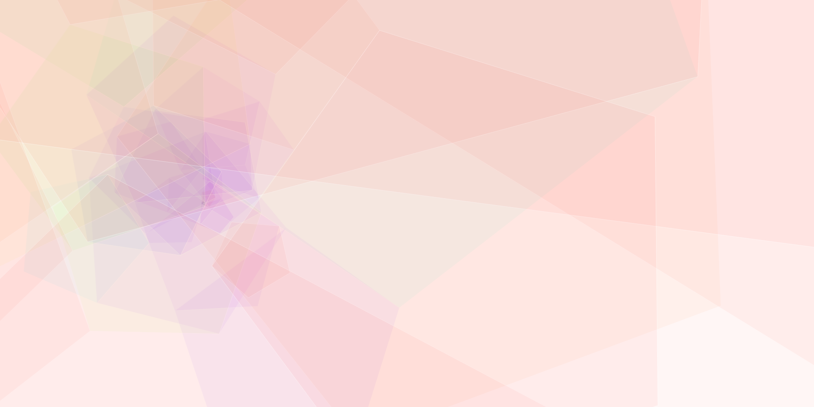
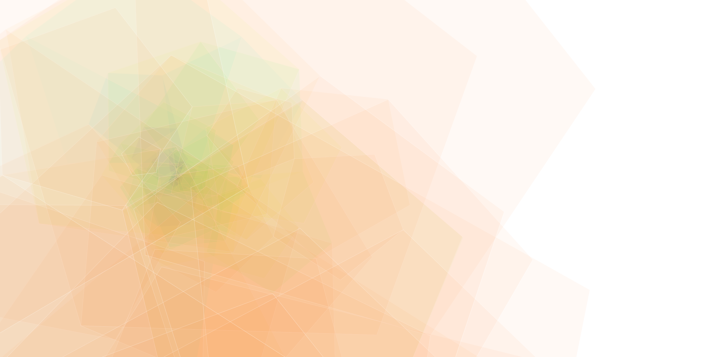
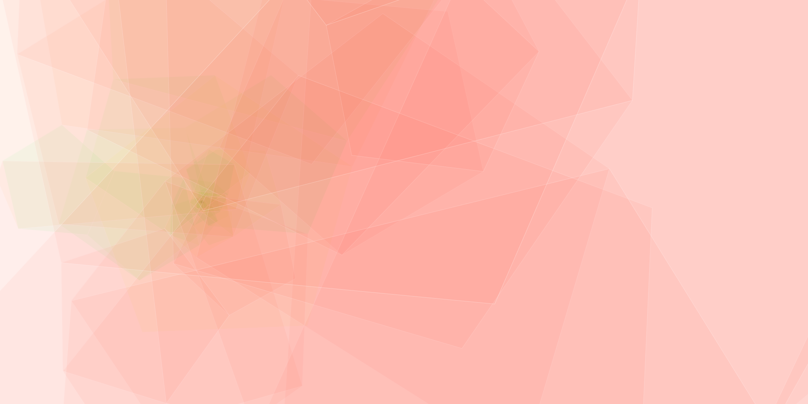

Pentagon Stack
=================

Course **Input/Output**

Semester **2014/15**

**University of Applied Sciences Potsdam**

<<<<<<< HEAD
processing-code for the algorithm project - generating pentagon-pattern based on a starting point and size

=======
Processing-code for the algorithm project - generating pentagon-pattern based on a starting point and size
>>>>>>> a62ef78672d242183bc82d3c02038ad37e53d2e9
